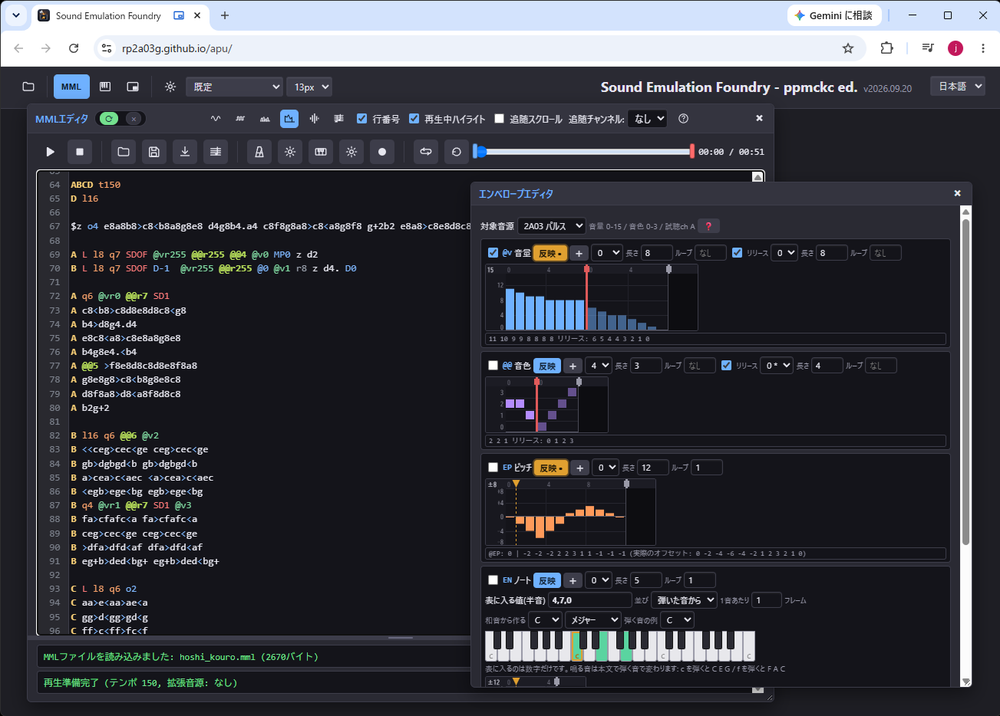
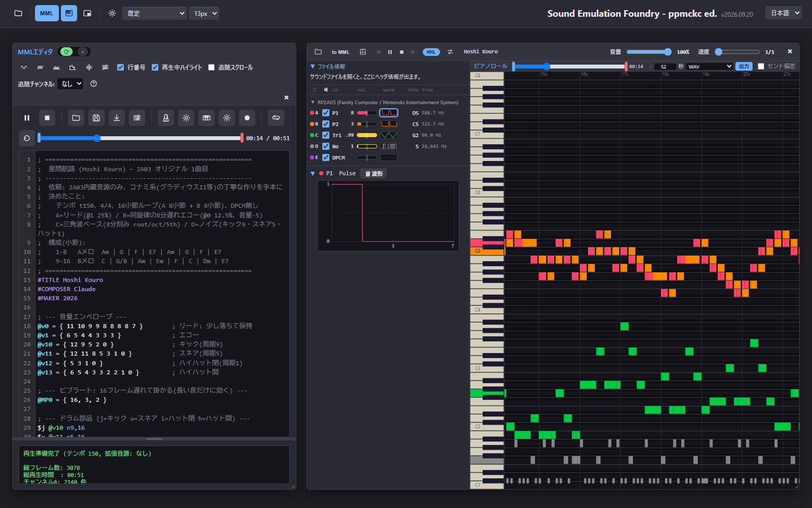

# Sound Emulation Foundry - ppmckc ed.

ブラウザだけで動くファミコン(RP2A03)＋拡張音源のMML制作環境。あわせて
NSF / NSFe / SPC / KSS / GBS / HES / VGM / PSF の再生・可視化・MML変換ができる。

MMLコンパイラ・6502アセンブラ・NSFジェネレーター・各音源のエミュレータはすべて自前のJavaScriptで、
外部ライブラリを使っていない。`index.html` をブラウザで開けばそれだけで動く
(ローカルに置いた `file://` 直開きでも、静的サーバーに置いても同じ)。

名前の「ppmckc ed.」は、MMLの方言とNSF書き出し用サウンドドライバをファミコン用MMLコンパイラ
ppmck / ppmckc に合わせてあることを指す。ppmck そのものの移植や派生ではなく、
仕様を実測で確かめながら書き起こした別実装で、独自に拡張した部分もある
(どのコマンドが ppmck 由来でどれが独自拡張かは、MMLコマンドヘルプと
[src/mml/compiler.js](src/mml/compiler.js) の冒頭に全部書いてある)。



MMLを書きながら、音量・音色・ピッチ・ノートの4種類のエンベロープを1画面で編集する。



鳴らすと、チャンネルごとの音程・音量・波形とピアノロールが演奏に同期して動く
(曲は2A03だけで書いたオリジナル「星間航路」)。

## できること

- **MMLで作曲して `.nsf` を書き出す** — ppmck方言のMML。2A03の5ch(パルス×2・三角波・ノイズ・DPCM)に加えて
  VRC6 / VRC7 / MMC5 / N163 / SUNSOFT 5B / FDS に対応する。エンベロープ(`@v` `@vr` `@@`)、
  ピッチ系(`EP` `MP` `PT` `PS` `s`)、ノートエンベロープ(`EN`)などのppmck拡張コマンドも
  ブラウザ再生とNSF書き出しの両方で動く。バンク切り替え対応なので4KBを超えるチャンネルも書ける
- **実機の曲を読んで聴く** — NSF / NSFe / SPC / KSS / GBS / HES / VGM / PSF(PlayStation、PSF1)。zip・7z・gzipの中身も開ける。
  CPUと音源をエミュレートして鳴らすので、曲送り・シーク・早送り・ch単位のミュートと音量調整ができる
- **鳴っている音を見る** — 鍵盤表示とピアノロールが、チャンネルごとの音程・音量・音色・
  波形・使用中のPCMサンプルを演奏に同期して描く
- **読んだ曲をMMLへ変換する** — 解析・学習・自分用アレンジの下地に。「MMLへ変換」で、鳴っているレジスタ列からMMLを起こす。
  借用先チャンネルの割り当て、基準ピッチの自動検出、エンベロープとビブラートの抽出、
  PCMのDPCM化までを通しで行う。変換の細かさは「⚙ 変換設定」で選べる
- **音色と波形を編集する** — FDS波形・N163波形・VRC7 FM音色・4種のエンベロープ・
  DPCMサンプルに、それぞれ専用のエディタがある
- **演奏して打ち込む** — PC鍵盤と画面のピアノで音を出し、そのまま録音してMMLにできる。
  メトロノーム付き
- **音声ファイルに書き出す** — WAV / FLAC / AAC
- **楽譜にする** — MusicXML書き出しと五線表示
- **外部エディタで書く** — `.mml` をディスク上の正本にして、VS Code や秀丸などで編集できる。
  保存すると約1秒で取り込まれる
- 表示・MMLコマンドリファレンスとも日本語と英語

## English

**Sound Emulation Foundry - ppmckc ed.** is a browser-based music workstation for the
Famicom / NES sound hardware (RP2A03) and its expansion chips. No build step, no external
libraries: open `index.html` in Chrome or Edge and it runs, either from a local `file://`
path or from any static server.

- **Compose in MML and export `.nsf`.** The MML dialect and the exported NES sound driver
  follow ppmck / ppmckc. Five 2A03 channels (2 pulse, triangle, noise, DPCM) plus
  VRC6 / VRC7 / MMC5 / N163 / SUNSOFT 5B (FME-7) / FDS, with the ppmck extension commands
  (`@v` `@vr` `@@` `EP` `MP` `PT` `PS` `s` `EN` ...) working both in browser playback and
  in the exported NSF. Bank switching is supported, so a channel may exceed 4 KB.
- **Play chiptune files.** NSF / NSFe / SPC / KSS / GBS / HES / VGM / PSF (PSF1), including
  files inside zip / 7z / gzip. The CPU and the sound chips are emulated, so you get track
  select, seeking, fast-forward, and per-channel mute and volume.
- **See what is playing.** A keyboard view and a piano roll draw pitch, volume, timbre,
  waveform and the PCM sample in use for every channel, in sync with playback.
- **Convert a song back into MML.** The register writes are turned into MML: channel
  assignment, reference-pitch detection, envelope and vibrato extraction, and PCM-to-DPCM
  conversion.
- **Edit tones and waveforms.** Dedicated editors for FDS waves, N163 waves, VRC7 FM tones,
  four kinds of envelope, and DPCM samples.
- **Play it in.** A PC-keyboard and on-screen piano with a metronome; record what you play
  straight into MML.
- **Export audio** as WAV / FLAC / AAC, and **sheet music** as MusicXML.
- **Link to a song.** Opening the app with `?nsf=<file address>&song=<n>` loads that file,
  so an app URL plus a file address makes one shareable link. Nothing is hosted here: the
  visitor's browser fetches the address directly, which means the host has to allow CORS
  (GitHub raw and Gist both do). Playback still needs one press of ▶, because browsers do
  not let it start on its own.

The interface, the bundled sample MML and the in-app MML command reference are all available
in Japanese and English. The documentation in this repository is Japanese only.

Licensed under GPL-2.0. **NSF files exported by this tool carry no obligations at all** —
what gets embedded in them is your song data plus the 6502 code generated by
`src/driver/ppmckDriver.js`, and that driver is distributed separately under 0BSD. See
[LICENSE.0BSD](LICENSE.0BSD) and [THIRD-PARTY-NOTICES.md](THIRD-PARTY-NOTICES.md).

Input files (NSF, SPC, VGM, ...) and anything converted from them carry the rights of the
original music and program.

## 実行方法

使うだけならビルドは要らない。`index.html` をブラウザで直接開けば動作する（外部依存なし、classic `<script>` 読み込み）。

### 画面の構成

左上のツールバーに、📂 ファイルを開く・MMLエディタ・鍵盤表示・ピアノロール・ミニ操作窓・設定が並ぶ。
各パネルはドラッグで動かせるフローティングウィンドウで、位置と大きさは記憶される。
ミニ操作窓は常に手前に出る小さな再生操作窓で、他のアプリで作業しながら操作できる。

### 実機の曲を聴く・MMLにする

📂 でサウンドファイル（NSF/NSFe・SPC・KSS・GBS・HES・VGM・PSF。zip・7z・gzipの中身も開ける）を読むと、
鍵盤表示にヘッダ情報とチャンネル一覧が出て再生が始まる。タイトル行の ⏮ ▶ ⏹ ⏭ が曲送りと再生で、
その右で曲が終わったときの挙動を選ぶ。チャンネルごとにミュートと音量スライダーがあり、
行の色は鍵盤・ピアノロールの色と連動する。
「MMLへ変換」で今の曲をMMLに起こしてMMLエディタへ流し込む。変換の細かさは隣の「⚙ 変換設定」で決める。
「WAVE書き出し」では WAV / FLAC / AAC を書き出せる。

PSF(PlayStation)は `.psf` と、共通部品 `.psflib` を参照する `.minipsf` の両方を開ける。
`.minipsf` は zip のまま開くか、`.psflib` と一緒に選ぶ(ドラッグ&ドロップも複数まとめて落とせる)。
PS2 の PSF2 には対応していない。

#### URLで曲を指すリンクを作る

`?nsf=<ファイルのアドレス>` を付けて開くと、そのアドレスからファイルを取ってきた状態で立ち上がる。
「アプリのURL＋曲のありか」を1本のリンクにして渡せる。曲番号は `?song=<n>`
(形式ごとのネイティブ表記。NSF/GBSは1始まり、KSS/HESは0始まり。zip/7zを指したときは
アーカイブ内の何曲目か)。パラメータ名は `?url=` でも同じ。

```
https://rp2a03g.github.io/apu/?nsf=https%3A%2F%2Fraw.githubusercontent.com%2F<user>%2F<repo>%2Fmain%2Fsong.nsf&song=3
```

対応形式は 📂 で開けるものと同じ(NSF/NSFe・SPC・KSS・GBS・HES・VGM・PSF・zip・7z)で、
アドレスに拡張子が無くてもファイルの先頭(マジック)から判別する。

このツールはファイルを一切預からない。リンクを踏んだ人のブラウザが毎回そのアドレスから
直接取ってくるだけで、置き場も権利関係もファイルを上げた人のところに残る。

- 取りに行けるのは `https://` のアドレスか、このページからの相対パス(`?nsf=songs/foo.nsf`)だけ。
- 別のサイトに置いたファイルは、**配布元がCORS(`Access-Control-Allow-Origin`)を許可していないと読めない**。
  ブラウザの制限なのでこちら側では外せない。GitHubのリポジトリ(`raw.githubusercontent.com`)と
  Gist(`gist.githubusercontent.com`)はどちらも `*` を返すので、そこに置いたファイルはそのまま読める。
- `file://` で開いたページでは使えない(`fetch` が許可されないため)。
- 読み込むところまでで、再生は始まらない。ブラウザが自動再生を許可しないので ▶ を1回押す。

### MMLを書く・鳴らす・NSFにする

MMLエディタのツールバーは、MML再生・停止・MMLファイルを開く・保存・NSF出力・メトロノーム・
演奏入力（PC鍵盤と画面のピアノ）・演奏の録音・ループ再生・再生範囲のリセット。
シークバーのハンドルで再生範囲を決められる。拡張音源はMML本文の `#EX-VRC6` などの宣言だけで有効になる。
`.mml` をウィンドウにドロップすると、そのファイルを正本として外部テキストエディタと同期する。
`.dmc` を一緒に選ぶ/ドロップすると `@DPCM` のサンプルとして読み込む(`.dmc` だけでもよい)。一度読んだ `.dmc` はブラウザ(IndexedDB)が**中身ごと**覚えていて、同じ `.mml` を開き直すと**ファイル名で**戻る。覚えているのはコピーであってディスク上の `.dmc` への参照ではないので、別のPC・サイトデータを消したあと・別オリジン(`file://` と公開URLは別)では戻らない。
`.mml` を保存しても `.dmc` は自動では書かれない(ブラウザは保存したファイルの親フォルダのハンドルを渡してくれないため、フォルダを一度選ぶまで書き先が無い)。保存すると見出し行に「.dmc 未保存」のバッジとログに「.dmc を MML と同じフォルダへ書き出す」ボタンが出るので、押してフォルダを選ぶと参照中の `.dmc` をそこへまとめて書く(ppmck と同じ置き方)。一度選んだフォルダは覚えていて、次からは保存するだけでそこへ書かれる(そのフォルダに今の `.mml` が居ることを確かめてから書く)。
逆に、`.mml` の隣に `.dmc` はあるがブラウザ側が覚えていないときは、「.dmc 未読込」のバッジかログの「フォルダから読み込む」でそのフォルダから読み戻せる。

FDS波形エディタ・N163波形エディタ・VRC7音色エディタ・エンベロープエディタ・音色一覧・
DPCMコンバータ・MMLコマンドヘルプは、MMLエディタの見出し行のボタンで開く。
どのエディタも「反映」を押すまでMML本文は変わらない。

「DPCMコンバータ」（MMLエディタ見出し行のボタン、またはMML本文の`@DPCM<n>`定義をダブルクリック）はMML内の`@DPCM<n>`定義を1行ずつ並べた表で、各行の📂で音声ファイル（`decodeAudioData`が読める形式なら何でも。`.dmc`はそのまま=変換なし）を読み、♪で原音/変換後を聴き比べ、DMCレート・ループ・ファイル名を決めて「反映」でMML本文へ書き込む（FDS/N163/VRC7エディタと同じく、反映するまでMMLは変わらない。未反映は「反映」ボタンの色で分かる）。DMC 1本の上限は4081バイト（`$4013`）なので、超える音は読み込み時にエラー表示になり、下段の波形（上=オリジナル、下=DPCM）で区切る（「限界で分割」でそのレートの上限に収まるよう均等に切るか、波形をダブルクリックして区切りを追加。境目はドラッグ、区間クリックでその区間だけ試聴。区間ごとに番号・使用/未使用・DMCレートを持ち、未使用=グレーは反映されず、上限超え=赤のままでは反映できない。反映すると使用区間ごとに`@DPCM`定義が連番で書かれ、`.dmc`は`<名前>_<区間番号>.dmc`になる）。💾で変換後の`.dmc`を名前を付けて保存できる（保存ダイアログの既定の位置は上で選んだ「`.mml` と同じフォルダ」。区間が複数ある行はフォルダを1回選んでまとめて書き出す）。

MMLエディタのヘッダにある「?」ボタンで「MMLコマンドヘルプ」が開く。ヘルプの中身は別ファイルではなく
**MML本文そのもの**で、`;@help <コマンド> :: <見出し> :: <カテゴリ>` というコメント行(コンパイルには影響しない)が
付いたブロックを索引化して表示する（`src/mml/helpIndex.js`）。各項目の「▶」でその実演スニペットだけを
その場で鳴らせる（曲中の定義行と当該チャンネルのセットアップ行を自動で足して自己完結MMLに組み立てる）。
表示ソースは「組み込みサンプル / エディタ本文 / 両方」から選べるので、自分のMMLに`;@help`を書けば
自分用の項目がそのまま増える。`node tools/headless/help-lint.js` で、タグの書式・実演スニペットの
コンパイル可否・`src/mml/compiler.js`の「対応コマンド:」一覧との突き合わせ（掲載漏れ検出）をブラウザ無しで点検できる。

## 動作環境

Chrome / Edge（Chromium系）で開発・確認している。次の機能はChromium系にしか無いAPIを使っていて、
無いブラウザでは該当機能だけが無効になる（本体は動く）。

- ファイルピッカーと外部エディタ同期（File System Access API）
- ミニ操作窓（Document Picture-in-Picture）

`file://` での直開きにも対応している（Chromeでは `file://` がsecure context扱いになるため、
ファイルピッカーもIndexedDBも使える）。静的サーバーに置いても同じように動く。

## 版番号

版番号は公開した日付（`2026.09.13` の形）。同じ日に2回以上出すときだけ末尾に `.2` `.3` を付ける。
画面右上のタイトルの横に出るので、不具合を知らせるときはこの番号を添えてほしい。

公開の手順は `src/version.js` の冒頭に書いてある（値を書き換えてコミット → `vYYYY.MM.DD` のタグ → GitHub でリリース）。
変換したMMLや書き出したNSFには版番号を入れない。

## 開発者向け

- [DESIGN.md](DESIGN.md) — 恒久的な設計原則（不変条件 INV-1〜6、Song IR仕様、層の分離ルール）。手を入れる前に読む
- [DESIGN-PITCH.md](DESIGN-PITCH.md) — 音程・デチューン・ビブラートまわりの設計と実測の記録
- [IMPLEMENTATION.md](IMPLEMENTATION.md) — どの順に何を作ってきたかの記録（フェーズ別の実装メモ）

### ヘッドレス実行ハーネス

ブラウザを開かずに変換器とエミュレータを動かすハーネスが `tools/headless/` にある。
一括変換の回帰テスト、CPU命令テスト、MMLヘルプの自己点検などはここから走らせる。
詳細は [tools/headless/README.md](tools/headless/README.md)。

回帰テストは手元のサウンドファイル群（コーパス）に対して走らせる。置き場所は環境変数で指定する。
ベースラインはコーパスと1対1に対応するので、リポジトリには入れていない（初回は `--update` で作る）。

```bash
export MML_CORPUS_ROOT="D:/snd"          # D:/snd/nsf, D:/snd/vgm ... を見る
node tools/headless/check-all.js         # 全形式の回帰 + CPU命令テスト + ヘルプ点検
node tools/headless/check-all.js --update  # 初回・意図した変化のあとはこれでベースライン更新
node tools/headless/help-lint.js         # MMLヘルプの書式・網羅チェック(コーパス不要)
node tools/headless/sample-sequence.js --write  # 組み込みサンプルMMLの章を順番に鳴らす待ち行([r1]N)を計算し直す(章の中身を変えたら実行。help-lintが重なりを検査)
```

### キャプチャWorkerのバンドル

`src/audio/*-capture-worker.js` の7本は生成ファイルで、直接編集しない。エミュレータと
変換器のソースを1つの関数の中へ連結したもので、`src/audio/capture-worker-client.js` が
`Function.prototype.toString` + Blob URL で Worker に仕立てる（`fetch` を使わないので
`file://` 直開きでも Worker が動く）。バンドルに含まれるソースを直したら再生成する。

```powershell
powershell -ExecutionPolicy Bypass -File tools/build-capture-workers.ps1
```

再生成を忘れたまま動かした場合は、実行時の鮮度チェックが気づいてメインスレッド側の
キャプチャへ退避し、コンソールに警告を出す（音は出るが遅い）。対象ファイルの一覧は
ビルドスクリプトの冒頭と [src/audio/README-worker-build.txt](src/audio/README-worker-build.txt) にある。

## ライセンス

本体は GNU General Public License version 2 — [LICENSE](LICENSE)。

### 書き出したNSFは自由に使ってよい

**このツールで書き出したNSFは、条件なしで使ってよい。** 配布・販売・
ゲームへの組み込みのどれでも、ライセンス表示やクレジットは要らない。

NSFに埋め込まれるのは、曲データと、サウンドドライバ `src/driver/ppmckDriver.js` が生成した
6502コードだけ。曲データは作曲した人のもので、ドライバは本体のGPLとは別に
**0BSD**（[LICENSE.0BSD](LICENSE.0BSD)）で配布しているので、どちらもGPLの義務は及ばない。
ドライバだけを取り出して自作のプログラムに使うのも自由。

ただし、他人の曲を変換して得たNSFは別の話で、下の「扱う音楽データについて」を参照。

### 第三者のコード

他の作者のコードを移植した部分（Nuked-OPLL、Nuked-OPN2、emu2413、LZMA SDK）と、
他の実装を参照して書き起こした部分がある。出所・著作者・ライセンスは
[THIRD-PARTY-NOTICES.md](THIRD-PARTY-NOTICES.md) にまとめてある。
Nuked-OPN2 由来の部分は LGPL-2.1 なので、その本文も [LICENSE.LGPL-2.1](LICENSE.LGPL-2.1) として同梱している。

### 扱う音楽データについて

NSF / NSFe / SPC / KSS / GBS / HES / VGM / PSF といった入力ファイル、およびそこから変換して得られる
MML・NSF・波形データには、原曲と元のプログラムの権利が及ぶ。

## 既知の制限

- **一部の機能はChromium系ブラウザでしか動かない**（ファイルピッカー・外部エディタ同期・ミニ操作窓）。
  Firefox / Safari でも本体は動くが、その機能だけが無効になる
- **書き出したNSFのテンポは、ブラウザ再生とわずかにずれることがある。** 変換側は非整数BPMを
  そのまま持つのに対し、MMLの `t<n>` は整数なので、往復すると0.3%程度の差が出る場合がある
  （`@t<len>,<num>` で書けばフレーム単位で一致する）
- **リポジトリ内のドキュメント(この README を除く)は日本語のみ。** 画面の表示・組み込みサンプル・
  MMLコマンドヘルプは日本語と英語に対応している
- **回帰テストには手元のサウンドファイル群（コーパス）が要る。** リポジトリにはテスト用の
  音楽データを一切含めていないので、クローンしただけでは一括回帰は走らせられない
  （コーパス不要の点検は `help-lint.js` などがある）

不具合の報告や要望は Issue へ。画面右上に出ている版番号（`2026.09.13` の形）を添えてもらえると追いやすい。
